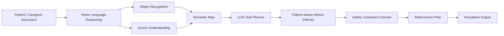
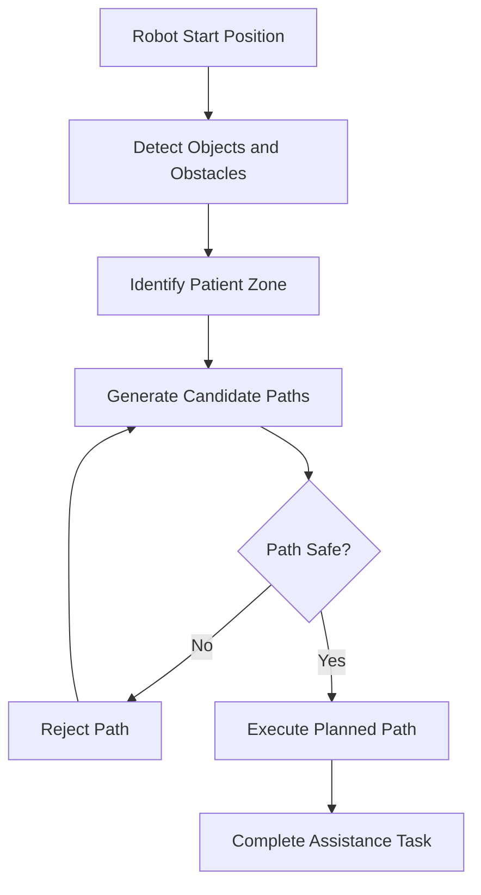

# SafeCareBot: Vision-Language-Guided Robotic Assistance for Healthcare Environments

> A multimodal embodied-AI framework for object recognition, scene understanding, language-guided task execution, and patient-aware motion planning in healthcare-like indoor environments.

[](#technical-stack)
[](#benchmark-environment)
[](#methodology)
[](#system-overview)
[](#motivation)
[](#patient-aware-motion-planning)
[](#benchmark-environment)

SafeCareBot is a simulation-based robotic assistance framework for healthcare-inspired indoor environments. The system allows a robot agent to receive natural-language instructions from a patient or caregiver, understand a scene using vision-language reasoning, detect relevant objects, reason about task steps, and generate a safe motion plan while avoiding obstacles and patient-restricted zones.

This project is designed as a research prototype for embodied AI, healthcare robotics, and safe language-guided robot planning. It does not claim clinical deployment or real-world medical validation.

---

## Table of Contents

- [Motivation](#motivation)
- [Problem Statement](#problem-statement)
- [System Overview](#system-overview)
- [Architecture Diagram](#architecture-diagram)
- [Methodology](#methodology)
- [Benchmark Environment](#benchmark-environment)
- [Example Healthcare Assistance Tasks](#example-healthcare-assistance-tasks)
- [Patient-Aware Motion Planning](#patient-aware-motion-planning)
- [Evaluation Metrics](#evaluation-metrics)
- [Preliminary Results](#preliminary-results)
- [Demo Scenario](#demo-scenario)
- [Repository Structure](#repository-structure)
- [Installation](#installation)
- [Usage Example](#usage-example)
- [Future Work](#future-work)
- [Citation and Acknowledgment](#citation-and-acknowledgment)

---

## Motivation

Healthcare environments require assistive systems that can interpret human instructions, reason about objects and spaces, and operate with strong safety constraints. A robot that simply finds the shortest path may not be appropriate around beds, patients, chairs, medical carts, or restricted patient zones.

SafeCareBot explores how multimodal AI can support safe robotic assistance in healthcare-like indoor scenes. The project focuses on simulation as a controlled environment for testing vision-language grounding, task planning, and safety-aware navigation before considering any real-world deployment.

---

## Problem Statement

Given a natural-language instruction such as:

> "Please bring the water bottle from the table to the patient."

the robot must:

| Capability | Requirement |
|---|---|
| Language understanding | Interpret the patient or caregiver request |
| Visual grounding | Identify relevant objects such as the water bottle, table, bed, and patient zone |
| Scene understanding | Build a semantic map of objects, obstacles, and restricted areas |
| Task planning | Generate an executable sequence of robot actions |
| Motion planning | Compute a collision-aware path through the scene |
| Safety checking | Avoid patient-restricted zones and unsafe trajectories |

The central challenge is combining perception, language-guided reasoning, and motion planning into a coherent embodied-AI pipeline without overstepping the limits of a simulation-based prototype.

---

## System Overview

SafeCareBot follows a modular embodied-AI pipeline:

1. Natural-language patient/caregiver instruction
2. Vision-language object grounding and scene understanding
3. Object recognition and semantic scene mapping
4. LLM-based task planning
5. Patient-aware motion planning
6. Safety constraint checking
7. Simulation output with planned robot actions and path visualization

### Core Modules

| Module | Role |
|---|---|
| Instruction Parser | Extracts task intent, target object, destination, and constraints |
| Vision-Language Reasoner | Grounds language in scene observations |
| Object Detector | Detects objects such as bottles, tables, beds, chairs, and assistive items |
| Scene Parser | Produces semantic labels for navigable space, obstacles, and patient zones |
| Task Planner | Converts the instruction into ordered high-level robot actions |
| Motion Planner | Generates candidate paths using A* or RRT* |
| Safety Checker | Rejects paths with collisions or patient-zone violations |
| Simulator Interface | Executes and visualizes the planned robot behavior |

---

## Architecture Diagram

The Mermaid source below can be rendered directly by GitHub. A static image version can also be added later as `assets/mermaid-diagram.png` or `assets/architecture.png`.



### Screenshot Placeholders

| Simulation Scene | Planned Path | Task Pipeline |
|---|---|---|
| `assets/demo_scene.png` | `assets/planned_path.png` | `assets/task_pipeline.gif` |
| Healthcare-like indoor room with bed, table, chair, and target object | Safe path around obstacles and patient-restricted zone | End-to-end instruction, perception, planning, and execution |

---

## Methodology

SafeCareBot integrates multimodal perception, language reasoning, and motion planning in a simulation-first workflow.

### 1. Natural-Language Instruction Processing

The system receives patient or caregiver instructions and extracts:

- Target object: `water_bottle`, `medicine`, `assistive_object`
- Source location: `table`, `counter`, `shelf`
- Destination: `patient`, `bedside_table`, `caregiver_location`
- Safety constraints: avoid bed zone, maintain minimum patient distance, avoid obstacles

### 2. Vision-Language Grounding

The perception module uses a vision-language model to associate language references with visual scene observations. Depending on the implementation setting, the module can use:

- GPT-4o for multimodal reasoning
- LLaVA, BLIP-2, or CLIP for open-source VLM workflows
- OWL-ViT, GroundingDINO, or YOLO for object localization

### 3. Semantic Scene Mapping

Detected objects are mapped into a semantic representation:

```json
{
  "objects": ["water_bottle", "table", "bed", "chair"],
  "restricted_zones": ["patient_zone"],
  "obstacles": ["bed", "chair", "table"],
  "navigable_regions": ["floor_area_1", "floor_area_2"]
}
```

### 4. LLM-Based Task Planning

The planner converts an instruction into high-level robot actions, such as:

```text
navigate_to_table -> pick_up_water_bottle -> plan_safe_path_to_bedside -> place_water_bottle_near_patient
```

### 5. Safety-Aware Motion Planning

The motion planner computes candidate paths and passes them through a safety checker. Candidate paths are rejected if they:

- Intersect with static obstacles
- Enter a patient-restricted zone
- Violate the minimum patient-distance constraint
- Require unstable or ambiguous object interaction

---

## Benchmark Environment

SafeCareBot uses an embodied-AI simulation environment inspired by AI2-THOR and RoboTHOR-style indoor scenes. The benchmark is healthcare-inspired rather than clinically validated.

### Scene Elements

| Category | Examples |
|---|---|
| Furniture | bed, table, chair, bedside table, shelf |
| Assistive objects | water bottle, medicine container, remote, cup |
| Restricted areas | patient zone, bed perimeter, blocked walkway |
| Robot state | start position, orientation, reachable workspace |
| Environmental constraints | obstacles, narrow paths, object visibility limits |

### Technical Stack

- Python
- AI2-THOR / RoboTHOR-style simulation
- OpenAI GPT-4o or open-source VLMs such as LLaVA, BLIP-2, or CLIP
- GroundingDINO / YOLO / OWL-ViT for object recognition
- A* or RRT* for motion planning
- NumPy, OpenCV, Matplotlib
- Optional ROS2-compatible design for future real-robot deployment

---

## Example Healthcare Assistance Tasks

| Task ID | Instruction | Target Object | Safety Focus |
|---|---|---|---|
| T1 | Bring the water bottle to the patient | water bottle | avoid bed/patient zone |
| T2 | Find the medicine on the bedside table | medicine | object grounding near restricted zone |
| T3 | Navigate to the bedside table | bedside table | collision-free navigation |
| T4 | Locate the assistive device near the chair | assistive object | object recognition under clutter |
| T5 | Move around the bed and stop near the caregiver | caregiver position | safe navigation around patient space |

---

## Patient-Aware Motion Planning

SafeCareBot models patient-aware planning as a constrained path-generation problem. The robot must reach task-relevant locations while maintaining a minimum distance from patient-restricted regions.



### ASCII Planning View

```text
Legend:
R = Robot Start
T = Target Object
B = Bed
P = Patient Zone
# = Obstacle
* = Safe Planned Path

+------------------------------------------------+
| R  *  *  *        # Chair                      |
|          *                                      |
|          *        T Water Bottle               |
|          *        Table                        |
|          *                                      |
|          *  *  *  *  *                         |
|                         B B B B B              |
|                         B P P B B              |
|                         B P P B B              |
+------------------------------------------------+
```

The path is planned to approach the bedside area without entering the patient zone.

---

## Evaluation Metrics

SafeCareBot is evaluated with benchmark-style simulation metrics:

| Metric | Description |
|---|---|
| Task Success Rate | Percentage of tasks completed with correct final state |
| Object Recognition Accuracy | Correct identification and localization of target objects |
| Instruction-Following Accuracy | Alignment between instruction intent and generated action plan |
| Collision Rate | Percentage of runs with obstacle collisions |
| Path Length | Distance traveled by the robot in simulation |
| Planning Time | Time required to generate a motion plan |
| Patient-Zone Violation Rate | Percentage of runs entering restricted patient zones |
| Safe Task Success Rate | Tasks completed successfully without collisions or safety violations |

---

## Preliminary Results

The values below are example simulation results from a preliminary prototype-style evaluation. They are intended as realistic placeholders for a completed research portfolio page and should be replaced with final measurements when experiments are finalized.

| Metric | Preliminary Simulation Result |
|---|---:|
| Task Success Rate | 82% |
| Collision-Free Navigation | 91% |
| Patient-Zone Violation Rate | 4% |
| Average Planning Time | 1.8 s |
| Object Grounding Accuracy | 86% |

### Task-Level Breakdown

| Task Category | Success Rate | Main Failure Mode |
|---|---:|---|
| Water bottle retrieval | 85% | target partially occluded |
| Medicine localization | 78% | similar object confusion |
| Bedside navigation | 88% | narrow obstacle spacing |
| Assistive object search | 80% | limited visibility in cluttered scenes |
| Patient-zone avoidance | 96% | conservative path rejection |

---

## Demo Scenario

### Input Instruction

```text
Please bring the water bottle from the table to the patient.
```

### System Behavior

1. The robot parses the instruction and identifies `water_bottle` as the target object
2. The vision-language module grounds `water_bottle`, `table`, `bed`, and `patient_zone`
3. A semantic map is generated from detected objects and obstacles
4. The LLM task planner generates a high-level action sequence
5. The motion planner computes a safe path to the table and then toward the bedside area
6. The safety checker rejects paths that enter the patient-restricted zone
7. The simulator outputs the final robot action plan and path visualization

### Example Output

```json
{
  "instruction": "Bring the water bottle to the patient",
  "detected_objects": ["water_bottle", "table", "bed", "chair", "patient_zone"],
  "target_object": "water_bottle",
  "safety_constraints": {
    "avoid_patient_zone": true,
    "minimum_patient_distance_m": 0.75,
    "collision_check": true
  },
  "planned_actions": [
    "navigate_to_table",
    "pick_up_water_bottle",
    "plan_safe_path_to_bedside",
    "place_water_bottle_near_patient"
  ],
  "status": "task_completed_safely"
}
```

---

## Repository Structure

```text
safe-carebot/
├── README.md
├── assets/
│   ├── architecture.png
│   ├── demo_scene.png
│   ├── planned_path.png
│   └── task_pipeline.gif
├── configs/
│   └── simulation_config.yaml
├── data/
│   └── healthcare_tasks.json
├── src/
│   ├── perception/
│   │   ├── object_detector.py
│   │   └── scene_parser.py
│   ├── planning/
│   │   ├── task_planner.py
│   │   ├── motion_planner.py
│   │   └── safety_checker.py
│   ├── simulation/
│   │   └── environment.py
│   └── main.py
├── notebooks/
│   └── demo_safe-carebot.ipynb
├── requirements.txt
└── LICENSE
```

---

## Installation

```bash
git clone https://github.com/your-username/safe-carebot.git
cd safe-carebot
pip install -r requirements.txt
```

Optional setup for simulator assets:

```bash
python src/simulation/environment.py --download-assets
```

---

## Usage Example

Run a language-guided assistance task:

```bash
python src/main.py --task "Bring the water bottle to the patient" --scene hospital_room_01
```

Run with a specific planner:

```bash
python src/main.py \
  --task "Bring the water bottle to the patient" \
  --scene hospital_room_01 \
  --planner astar \
  --avoid-patient-zone
```

Expected output includes:

- Detected scene objects
- Target object grounding
- Semantic map summary
- Safety constraints
- Planned robot action sequence
- Planned path visualization
- Simulation status

---

## Future Work

- Add real hospital-room 3D layouts
- Integrate ROS2 and real robot navigation
- Add human-in-the-loop confirmation
- Improve patient-intent understanding
- Add uncertainty estimation for safety-critical decisions
- Expand benchmark tasks for healthcare assistance
- Evaluate with more embodied-AI environments

---

## Citation and Acknowledgment

If you use or adapt this project, please cite it as:

```bibtex
@misc{safe-carebot2026,
  title        = {SafeCareBot: Vision-Language-Guided Robotic Assistance for Healthcare Environments},
  author       = {Mohammad Yahyaei},
  year         = {2026},
  note         = {Simulation-based embodied-AI prototype for healthcare-inspired robotic assistance}
}
```

This project is inspired by research in embodied AI, vision-language models, robotic motion planning, and safe assistive robotics. The simulation setting is healthcare-inspired and intended for research prototyping only.

---

## Responsible Use Notice

SafeCareBot is a simulation-based research prototype. It is not a medical device, has not been clinically validated, and should not be used for real patient care or autonomous operation in clinical environments without extensive safety engineering, regulatory review, and human oversight.
